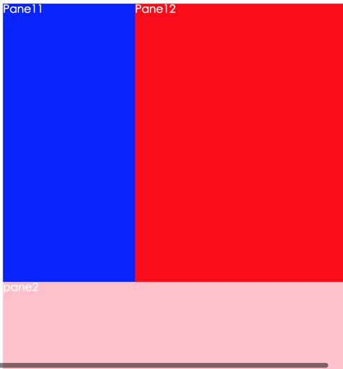

# uxcore-layout
---

uxcore-layout ui component for react



```sh
$ git clone https://github.com/uxcore/uxcore-layout
$ cd uxcore-layout
$ npm install
$ npm run dev
```

then nav http://localhost:9090/example/ to see the demo

## Apply scope

* use layout for what layout you want

	```
		var Layout = require('../lib/index.jsx');
require("../style/index.css")
var jsdom=(<Layout jsxrows="400,*">
			<div style={{background: 'yellow',color:'#fff'}}>
				<Layout jsxcols="190,*">
						<div style={{background: '#00f',color:'#fff'}}>Pane11</div>
						<div style={{background: 'red',color:'#fff'}}>Pane12</div>
				</Layout>
			</div>
			<div style={{background: 'pink',color:'#fff'}}>pane2</div>
		</Layout>);
React.render(jsdom, document.getElementById('content'));


	```

## Attr

* jsxrows -- for horizontal layout
* jsxcols -- for vertical layout
* * stand for the rest width/height of target 

